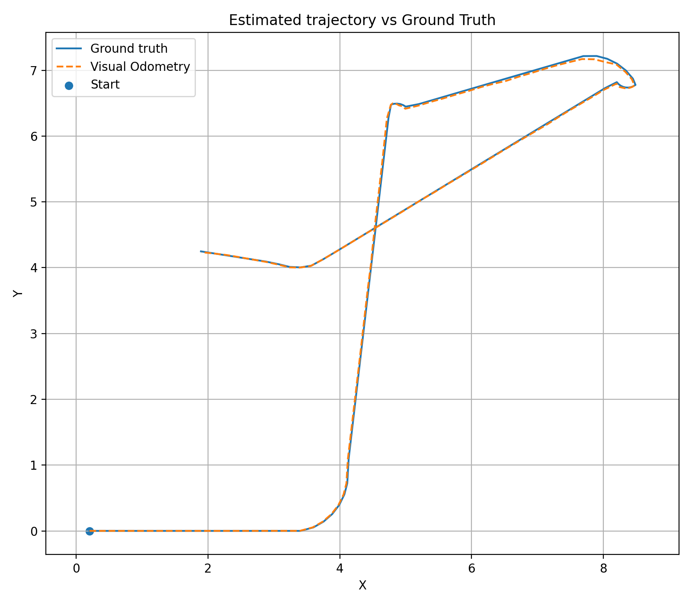
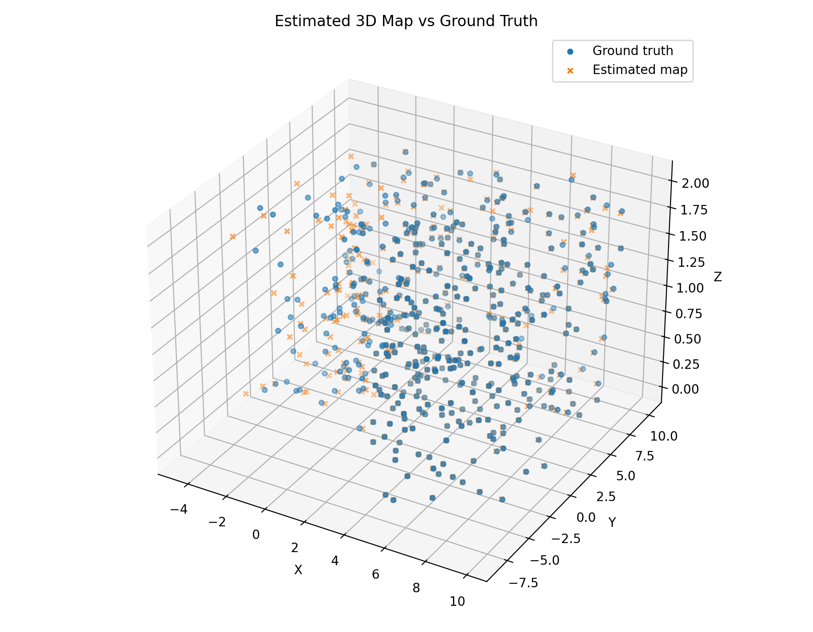

# Visual Odometry

This project was developed for the Probabilistic Robotics course.

The goal is to implement a monocular Visual Odometry pipeline able to estimate the camera trajectory from a sequence of image measurements. During the process, a sparse 3D map of the environment is also reconstructed.

The implementation is written in C++ using Eigen.

## Approach

The first two frames are used to initialize the Visual Odometry system. Feature correspondences are found using the appearance descriptors provided in the dataset.

From these correspondences, the Essential Matrix is estimated and decomposed to recover the relative motion between the first two camera poses. The correct solution is selected using the cheirality condition, and the first 3D landmarks are obtained by triangulation.

For the following frames, the camera pose is estimated using Projective ICP. The pose is optimized by minimizing the reprojection error with Gauss-Newton optimization on SE(3). A backtracking line search is used to avoid pose updates that increase the reprojection error.

After estimating each new camera pose, new landmarks can be triangulated and added to the map. In this way, the trajectory and the 3D map are built incrementally.

Ground truth information is not used during the Visual Odometry estimation. It is only used at the end for trajectory and map evaluation.

## Build

The project requires CMake and Eigen3.

From the project directory:

```bash
mkdir build
cd build
cmake ..
make
```

## Run

From the `build` directory:

```bash
./visual_odometry
```

The program processes the complete sequence from frame `0` to frame `120`.

The estimated trajectory and map are saved in:

```text
trajectory.csv
map.csv
```

## Visualization

The plots are generated with Python using NumPy and Matplotlib.

A virtual environment can be created with:

```bash
python3 -m venv .venv
source .venv/bin/activate
pip install numpy matplotlib
```

Then run:

```bash
python plot_results.py
```

This generates:

```text
trajectory_comparison.png
map_comparison.png
```

## Results

The complete sequence contains 121 camera poses and 120 relative motions.

| Metric | Result |
|---|---:|
| Camera poses | 121 |
| Evaluated relative poses | 120 |
| Final map points | 490 |
| Mean rotation error | `1.3136e-05` |
| Mean translation scale ratio | `5.00458` |
| Scale ratio standard deviation | `0.298704` |
| Map RMSE | `0.147315` |

Since monocular Visual Odometry cannot recover the absolute metric scale, the estimated trajectory and map are rescaled before comparison with the ground truth.

The map RMSE is expressed in the coordinate units used by the dataset.

## Trajectory



## 3D Map


